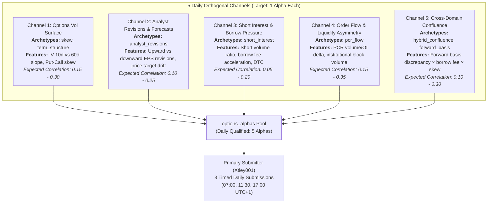

# `brain_options`: WorldQuant BRAIN Options Alpha Specialist Pipeline

A standalone, hyper-specialized quantitative alpha discovery and simulation pipeline for **WorldQuant BRAIN**, focused exclusively on the **Options** category (Platform Value Score: **6.0**, 13x less crowded than Price/Volume).

---

## 1. Why Options?

| Metric | Price/Volume (`pv`) | Options (`option`) | Edge |
| :--- | :---: | :---: | :--- |
| **Brain Value Score** | `2.0` (Lowest tier) | **`6.0` (3x higher)** | Huge platform allocation multiplier |
| **Platform Alphas** | `4,775,794` (Saturated) | **`353,031` (Uncrowded)** | 13x less platform correlation penalty |
| **Available Fields** | `32` pure PV fields | **`138` institutional fields** | Smart money derivatives positioning |

The Options category unlocks institutional derivatives pricing data—including put-call ratios, volatility skew steepness, call breakeven prices, and synthetic forward expectations—that pure technical price-volume formulas cannot capture.

---

## 2. Quantitative Archetypes

`brain_options` generates alpha expressions strictly across 5 proven derivatives-pricing phenomena:

1. **Synthetic Forward Basis Spread (Market-Implied Stock Drift)**:
   $$\text{group\_neutralize}(\text{rank}((\text{forward\_price\_30} - \text{close}) / \text{close}), \text{sector})$$
   *Quant Logic:* Compares institutional synthetic forward expectations against spot prices.

2. **Put-Call Volume & Open Interest Ratios (Smart Money Flow & Squeezes)**:
   $$\text{group\_neutralize}(\text{rank}(-\text{ts\_zscore}(\text{pcr\_vol\_20}, 40)), \text{sector})$$
   *Quant Logic:* Identifies capitulation / excessive put buying (bullish squeeze) vs euphoria / call speculation (bearish top).

3. **Implied Volatility Skew Acceleration (Downside Tail Risk)**:
   $$\text{group\_neutralize}(\text{rank}(-\text{ts\_delta}(\text{implied\_volatility\_mean\_skew\_30}, 5)), \text{subindustry})$$
   *Quant Logic:* Sudden steepening of OTM put skew signals institutional crash-protection buying prior to breakdowns.

4. **Call Breakeven Hurdle Rate Gating**:
   $$\text{trade\_when}(\text{volume} > \text{adv20}, \text{group\_neutralize}(\text{rank}((\text{call\_breakeven\_30} - \text{close}) / \text{close}), \text{sector}), -1)$$
   *Quant Logic:* Evaluates upside potential to reach option writers' breakeven hurdle price, confirmed by volume.

5. **Volatility Term Structure & Variance Risk Premium (VRP)**:
   $$\text{group\_neutralize}(\text{rank}(-(\text{implied\_volatility\_mean\_30} / (\text{implied\_volatility\_mean\_90} + 0.001) - 1.0)), \text{sector})$$
   *Quant Logic:* Exploits mean-reverting shocks in front-month vs 3-month implied volatility.

---

## 3. Architecture & Screening Funnel

```
[Options Candidate: Templates & LLM Reasoning]
                     │
                     ▼
┌──────────────────────────────────────────────┐
│  STAGE 0: Fast Screen (1 Simulation)         │  Settings: Universe=TOP3000, Delay=1, Decay=8, Neut=SUBINDUSTRY
│  Criteria: Sharpe ≥ 0.35, Fitness ≥ 0.20     │  Purpose: Weed out unviable noise quickly
└──────────────────────┬───────────────────────┘
                       │ (PASS)
                       ▼
┌──────────────────────────────────────────────┐
│  STAGE 1: Neutralization × Decay Grid        │  Sweeps: 5 Neutralizations (SUBINDUSTRY, INDUSTRY, SECTOR,
│  Optimization (25-30 Simulations)            │          MARKET, NONE) × 5 Decays (0, 4, 8, 15, 20)
│  Criteria: Pick highest Fitness combo        │
└──────────────────────┬───────────────────────┘
                       │
                       ▼
┌──────────────────────────────────────────────┐
│  LOCAL FILTER & CORRELATION GATES            │  Criteria: Sharpe ≥ 1.25, Fitness ≥ 1.00,
│  Final Acceptance Bar                        │            Turnover 1% - 70%, Max Pool Correlation < 0.70
└──────────────────────┬───────────────────────┘
                       │ (PASS)
                       ▼
⭐ [PASSED ALPHA: Saved to store & Alerted via Telegram with full BRAIN parameters]
```

---

## 4. 5-Channel Orthogonality Architecture (Target: 5 Qualified Alphas/Day)

To guarantee that newly qualified alphas remain mutually non-correlated ($\text{Corr} < 0.70$), generation is structured across **5 independent information regimes**:



### Core Execution Pillars
1. **Dynamic Archetype Daily Caps (Hard Cap = 1/family/day):**
   When an archetype produces 1 qualified alpha for the current calendar day, its MAB selection weight is automatically dropped to **`0.02`**, actively steering worker organizations into unfilled orthogonal channels.
2. **Pre-Simulation In-Memory Deduplication (AST Distance):**
   Formulas are parsed into canonical Python Abstract Syntax Trees (AST). Floating-point constants are normalized, integer lookbacks are bucketed into speed regimes, and structural duplicates are rejected in **`< 1 ms`**, saving $\sim 30\%$ of WorldQuant BRAIN simulation quota.
3. **Multi-Speed Horizon Dispersal:**
   - **Fast / High-Turnover (Holding: 1–3 Days):** `decay=3-5, delay=1, lookback=5-15`
   - **Medium / Swing (Holding: 1–2 Weeks):** `decay=10, delay=1, lookback=20-30`
   - **Slow / Structural (Holding: 1 Month+):** `decay=20, delay=1, lookback=60-252`
4. **Pre-Qualification Correlation Gate:**
   Every candidate meeting raw Sharpe $\ge 1.25$ and Fitness $\ge 1.00$ is screened in real time against historical pool PnL and live BRAIN `/correlations/self`. Alphas with $\ge 0.70$ correlation are routed to `options_correlated_alphas` to keep the qualified pool pristine.

---

## 5. Usage & Operations

### Quick Test / Dry Run (No simulation quota spent)
```bash
python -m brain_options.run --dry-run --candidates 8
```

### Single Bounded Batch (Scheduled Worker Mode)
Runs one bounded batch of candidates, screens, optimizes, runs AST deduplication, and records metrics:
```bash
python -m brain_options.run --single-batch --candidates 10
```

### Multi-Organization Synchronization
Synchronize latest code, templates, and algorithms across all 4 satellite worker organizations:
```bash
python scripts/org_manager.py --sync
```

---

## 6. Storage & Infrastructure

- **Qualified Alphas:** `options_alphas` (PostgreSQL Neon DB & local CSV/JSON mirrors).
- **Correlated Alphas Archive:** `options_correlated_alphas` (tracks near-misses with correlation $\ge 0.70$).
- **Evaluations History:** `options_evaluations` (comprehensive telemetry for every simulated candidate).
- **Cluster Locks:** Distributed Postgres mutex (`cluster_run_lock`) preventing worker overlap.
- **Shared Session Cache:** Multi-org centralized BRAIN JWT cookie reuse.

