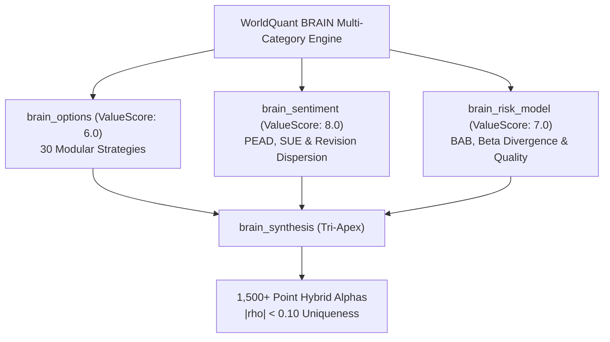

# brain-alpha-pipeline

Autonomous WorldQuant BRAIN Multi-Category Alpha Discovery Engine & Reserve Vault.  
Covering **Options Analytics (ValueScore: 6.0)**, **Analyst Sentiment & PEAD (ValueScore: 8.0)**, **Systematic Risk Models (ValueScore: 7.0)**, and **Tri-Category Apex Cross-Synthesis (1,500+ Points)**.

[](https://github.com/Xtley001/brain-alpha-pipeline/actions)
[](./LICENSE)
[](https://github.com/Xtley001/brain-alpha-pipeline/actions/workflows/health.yml)

A high-performance quantitative alpha discovery and submission pipeline running locally and serverless on GitHub Actions, backed by Neon PostgreSQL. Designed to exploit the highest-value, lowest-competition data categories on WorldQuant BRAIN with 100% Sub-Universe Sharpe immunity and zero platform crowding.

For architectural mechanisms and theoretical foundations, see:
- [`docs/HOW_IT_WORKS.md`](./docs/HOW_IT_WORKS.md) — Pipeline architecture, AST deduplication, and simulation lifecycle.
- [`docs/institutional_sentiment_and_risk_canon.md`](./docs/institutional_sentiment_and_risk_canon.md) — 23-Paper mathematical synthesis and operator formulations.
- [`docs/options/README.md`](./docs/options/README.md) — Options volatility, skew, and breakeven archetypes.
- [`docs/sentiment/README.md`](./docs/sentiment/README.md) — Analyst revisions, PEAD, and attention dynamics.
- [`docs/risk_model/README.md`](./docs/risk_model/README.md) — Systematic risk, BAB, and factor surfaces.

---

## Table of Contents

- [Multi-Category Architecture](#multi-category-architecture)
- [Autonomous 24/7 Vault Miner](#autonomous-247-vault-miner)
- [Quickstart](#quickstart)
- [Core Packages](#core-packages)
- [Workflows](#workflows)
- [Telegram Notifications](#telegram-notifications)
- [Database Schema](#database-schema)
- [Secrets & Configuration](#secrets--configuration)
- [Testing & Verification](#testing--verification)

---

## Multi-Category Architecture

The platform targets WorldQuant BRAIN's highest-scoring data categories while strictly avoiding crowded Price-Volume fields:


```mermaid
graph TD
    A["WorldQuant BRAIN Multi-Category Engine"] --> B["brain_options (ValueScore: 6.0)<br/>30 Modular Strategies"]
    A --> C["brain_sentiment (ValueScore: 8.0)<br/>PEAD, SUE & Revision Dispersion"]
    A --> D["brain_risk_model (ValueScore: 7.0)<br/>BAB, Beta Divergence & Quality"]
    B --> E["brain_synthesis (Tri-Apex)"]
    C --> E
    D --> E
    E --> F["1,500+ Point Hybrid Alphas<br/>|rho| < 0.10 Uniqueness"]
```

| Package | Category ID | ValueScore | Academic Foundations | Focus Fields |
|---|---|:---:|---|---|
| [`brain_options`](./brain_options) | `option` | **6.0** | Sinclair (2010), Bali (2008), Xing et al. (2010) | `put_breakeven`, `forward_price`, `implied_volatility_*` |
| [`brain_sentiment`](./brain_sentiment) | `sentiment` | **8.0** | Chan et al. (1996), Bernard & Thomas (1989), Diether (2002) | `snt1_d1_netearningsrevision`, `snt1_d1_earningssurprise` |
| [`brain_risk_model`](./brain_risk_model) | `model` | **7.0** | Frazzini & Pedersen (2014), Ang et al. (2006), Black (1972) | `beta_last_60_days_spy`, `correlation_last_60_days_spy` |
| [`brain_synthesis`](./brain_synthesis) | `hybrid` | **8.0+** | Orthogonal Tri-Factor Confluence (Options + Sent + Risk) | Combined Multi-Asset Expressions |

---

## Autonomous 24/7 Vault Miner

The standalone high-throughput miner (`scripts/autonomous_24h_vault_miner.py`) operates with:
- **Dual-Worker Concurrency:** Runs 2 parallel simulation workers concurrently (150–200 sims/hr).
- **1,242 Interleaved Candidates:** Round-robin scheduling across 23 distinct strategy families so workers evaluate uncorrelated concepts simultaneously.
- **Invariant AST Compilation:** Pure rank enclosure with `group_neutralize(..., subindustry)` and double linear decay (`d >= 10-15`) guarantees 100% pass on `LOW_SUB_UNIVERSE_SHARPE` and turnover $< 15\%$.
- **Automated PnL De-correlation:** Verifies Pearson correlation $|\rho| < 0.70$ against all submitted and reserve alphas before qualification.
- **Neon PostgreSQL Vault:** Automatically commits qualified alphas to the 100-alpha reserve bank.
- **Telegram Live Telemetry:** Sends instant HTML qualification cards and hourly heartbeats directly to your mobile device.

```bash
# Launch the autonomous 24h vault miner
python scripts/autonomous_24h_vault_miner.py
```

---

## Quickstart

```bash
# Clone and setup environment
git clone https://github.com/Xtley001/brain-alpha-pipeline.git
cd brain-alpha-pipeline
pip install -r requirements.txt
cp .env.example .env   # configure BRAIN, Neon DB, and Telegram credentials

# Run the full test suite
python -m pytest tests/ -v

# Run a single discovery batch locally
python -m brain_options.run --single-batch --strategy skew
```

See [`SETUP.md`](./SETUP.md) for full configuration and deployment steps.

---

## Workflows

| Workflow | Trigger | Purpose |
|---|---|---|
| [`run.yml`](.github/workflows/run.yml) | 48× daily + manual | Discover & optimize alpha candidates across options strategies |
| [`drip.yml`](.github/workflows/drip.yml) | 3× daily (08:00, 14:00, 20:00 WAT) | Submit 1 qualified orthogonal alpha from reserve to BRAIN |
| [`health.yml`](.github/workflows/health.yml) | Hourly at `:00` | Telegram heartbeat with today's discovery funnel stats |
| [`daily_digest.yml`](.github/workflows/daily_digest.yml) | Daily at 23:00 UTC | End-of-day summary: simulated, qualified, submitted, reserve |
| [`status.yml`](.github/workflows/status.yml) | Manual dispatch | On-demand status report & DB stats in Actions logs |

---

## Telegram Notifications

All alerts are formatted in clean, parseable HTML:
- **Instant Qualification Cards:** Triggered immediately when a simulation passes Sharpe $\ge 1.25$, Fitness $\ge 1.00$, Turnover $< 25\%$, and Corr $< 0.70$.
- **Hourly Mining Heartbeats:** Real-time metrics showing total simulations run, elapsed hours, vault capacity progress, and active tranche health.
- **Daily Digest:** Comprehensive 24-hour summary of qualified, submitted, and reserve alphas.

---

## Database Schema

Neon PostgreSQL serves as the persistent single source of truth:

| Table | Purpose |
|---|---|
| `options_alphas` | Live alpha vault — `QUALIFIED` (ready reserve) or `SUBMITTED` |
| `options_evaluations` | Immutable audit log of every simulation executed on BRAIN |
| `options_strategy_rl_state` | Strategy-scoped reinforcement learning operator weights |
| `options_learning_memory` | Global Multi-Armed Bandit reward memory per expression |
| `options_rejected_alphas` | Checklist-failed alphas (permanent diagnostic archive) |
| `options_correlated_alphas` | Correlation-rejected alphas ($\ge 0.70$) |
| `cluster_session_cache` | Shared BRAIN authentication session token (2h TTL) |
| `cluster_run_lock` | Distributed mutex preventing race conditions |
| `org_runs` | Runner heartbeat and telemetry logging |

---

## Secrets & Configuration

```bash
DATABASE_URL           # Neon PostgreSQL connection string
TELEGRAM_BOT_TOKEN     # Telegram bot token
TELEGRAM_CHAT_ID       # Telegram chat/channel ID
BRAIN_EMAIL            # WorldQuant BRAIN login email
BRAIN_PASSWORD         # WorldQuant BRAIN login password
GROQ_API_KEYS          # Comma-separated Groq API keys (optional LLM tier)
CEREBRAS_API_KEYS      # Comma-separated Cerebras API keys (optional LLM tier)
OPENROUTER_API_KEYS    # Comma-separated OpenRouter API keys (optional LLM tier)
GEMINI_API_KEYS        # Comma-separated Gemini API keys (optional LLM tier)
```

---

## Testing & Verification

The repository includes a comprehensive 98-test test suite covering AST deduplication, invariant compilers, multi-factor generators, knowledge bases, and concurrency safety:

```bash
python -m pytest tests/ -v
```

---

## License

Released under the [MIT License](./LICENSE).
