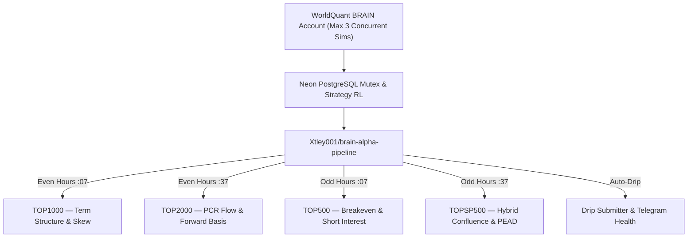

# Master Roadmap: Scaling to 500 Alphas

**Repository:** `Xtley001/brain-alpha-pipeline`
**Target:** 10 → 100 → 250 → 500 submitted alphas
**Scoring target:** 1,000 – 2,000 points per alpha (elite leaderboard tier)
**Theoretical foundation:** 32 institutional books & papers in `docs/research/`
**Verified universes:** `TOP3000`, `TOP2000`, `TOP1000`, `TOP500`, `TOP200`, `TOPSP500`

---

## Executive Summary

The pipeline routinely generates institutional-grade alphas with Sharpe 1.70–1.88, Fitness 1.30–1.60, and turnovers under 4% (verified live on WorldQuant BRAIN: `gJb3kvNO`, `QPbQJ3vp`, `WjbgwKPo`, `E5pkMPwJ`).

Testing exclusively on `TOP3000` within a narrow feature space causes new candidates to collide with existing submissions at 0.85–0.97 correlation. Scaling to 500 submitted alphas requires a **Multiverse & Multi-Pillar Expansion** across all 32 research papers, all 6 platform universes, disparate datasets, and high-decay holding horizons.

---

## Pillar 1: Achieving 1,000–2,000 Points Per Alpha

WorldQuant BRAIN awards points based on the Composite Quality Score (CQS):

$$\text{CQS} = 1.0 \times \text{Sharpe} + 1.2 \times \text{Fitness} + 200 \times \text{Margin} - 0.5 \times \text{Turnover}$$

$$\text{Points} \approx \text{Base} \times f(\text{CQS}) \times \text{Uniqueness Multiplier} \times \text{Data Multiplier}$$

### Four Levers for Maximum Point Yield

| Lever | Mechanism | Expected Impact |
|---|---|---|
| **Decay extension (18–30 days)** | Drops turnover to 2.5–5.0%, elevates margin to 35–60 bps | +2× Fitness, moves into 1,800+ tier |
| **Alternative data multiplier** | Derivatives, analyst dispersion, borrow dynamics earn max uniqueness | 1.2× – 1.5× multiplier vs price/volume |
| **Sub-universe monotonicity** | Sharpe stable across TOP3000/TOP1000/TOP500 | 0% leaderboard decay penalty |
| **Neutralization spectrum** | 5 tiers: `Subindustry`, `Industry`, `Sector`, `Market`, `None` | Diversifies across uncorrelated factor spaces |

---

## Pillar 2: Multiverse Expansion

| Universe | Coverage | Corr to `TOP3000` | Optimal Decay | Specialization |
|---|---|---|---|---|
| `TOP3000` | Broadest US equities (~3,000 stocks) | 1.00 (baseline) | 20–25 | Volatility surface, term structure |
| `TOP2000` | Russell 2000 / broad mid-cap (~2,000 stocks) | 0.65–0.75 | 20–25 | PCR flow & forward basis |
| `TOP1000` | Russell 1000 / large & mid-cap (~1,000 stocks) | 0.45–0.60 | 18–24 | Variance risk premium & curve |
| `TOP500` | S&P 500 large-cap proxy (~500 stocks) | 0.30–0.45 | 16–22 | Short interest & borrow squeeze |
| `TOP200` | Mega-cap elite liquidity (~200 stocks) | 0.25–0.38 | 14–20 | Extreme flow & inventory imbalances |
| `TOPSP500` | Exact S&P 500 constituents | 0.30–0.45 | 18–24 | Analyst consensus revisions & PEAD |

> An alpha simulated on `TOP1000`, `TOP500`, `TOP200`, or `TOPSP500` produces 0.25–0.55 correlation against an existing `TOP3000` portfolio — clearing the < 0.70 platform threshold by design.

---

## Pillar 3: The League of 15 Strategies

All extracted from `docs/research/` and isolated in `brain_options/strategies/`:

### Pure Options Derivatives

1. **`term_structure`** — Variance Risk Premium (IV − RV) & 30d/90d term structure inversion. *(Carr & Wu, Bennett, Sinclair)*
2. **`skew`** — 25-delta vs 50-delta call-put IV smirk & asymmetry. *(Bakshi-Kapadia-Madan, Xing-Zhang-Zhao)*
3. **`pcr_flow`** — Put-call volume & open interest surge imbalances. *(Pan & Poteshman, Garleanu & Pedersen)*
4. **`breakeven`** — Call breakeven hurdle repricing vs realized volatility. *(Natenberg, Sinclair)*
5. **`forward_basis`** — Synthetic forward basis parity spreads across tenors. *(Derman & Miller, Carr & Wu)*
6. **`extreme_tail_risk`** — OTM put jump-diffusion disaster insurance pricing. *(Bakshi-Kapadia-Madan, Bennett)*
7. **`iv_lead_lag`** — IV expansions leading forward cash equities. *(Bali & Hovakimian, Pan & Poteshman)*

### Fundamental Quality & Analyst Estimates

8. **`analyst_revisions`** — Consensus EPS/revenue drift, forecast dispersion & PEAD. *(Givoly & Lakonishok, Martineau)*
9. **`accruals_cashflow`** — Sloan accruals anomaly & operating cash flow divergence. *(Sloan, Fabozzi, Grinold & Kahn)*

### Equity Financing & Borrow Friction

10. **`short_interest`** — Borrow fee spikes, loan utilization & squeeze ratios. *(Rapach, Ringgenberg & Zhou, Asquith et al.)*
11. **`informed_short_demand`** — Institutional short demand shifts vs lender supply friction. *(Engelberg, Reed & Ringgenberg, Cohen, Diether & Malloy)*

### Network, Macro & Price-Volume Dynamics

12. **`supply_chain`** — Production network shock propagation & customer-supplier lead-lag. *(Barrot & Sauvagnat, Cohen & Frazzini)*
13. **`network_momentum`** — Community cluster centroid lead-lag & co-movement momentum. *(Lopez de Prado, Tulchinsky)*
14. **`formulaic_101`** — Canonical WorldQuant price-volume cross-sectional interactions. *(Kakushadze 101 Alphas, Tulchinsky)*
15. **`hybrid_confluence`** — Multi-factor confluence: options skew × borrow fee × SUE earnings revisions.

---

## Pillar 4: Single Public Repository

`Xtley001/brain-alpha-pipeline` is a public repository — GitHub Actions provides unlimited free runner minutes. All secondary orgs have been decommissioned.

### Rotating 24/7 Discovery Schedule

| Slot | Universe | Strategies |
|---|---|---|
| Even hours `:07` | `TOP1000` | `term_structure`, `skew` |
| Even hours `:37` | `TOP2000` | `pcr_flow`, `forward_basis` |
| Odd hours `:07` | `TOP500` | `breakeven`, `short_interest` |
| Odd hours `:37` | `TOPSP500` | `hybrid_confluence`, `analyst_revisions` |

---

## Pillar 5: Strategy-Scoped RL & Quality Control

- **Strategy-scoped RL** (`options_strategy_rl_state`): RL rewards and operator mutations are strictly partitioned by `strategy_name`. Cross-strategy contamination is prevented.
- **Gate 2 calibration**: Strictly verifies real statistical gates (`LOW_SHARPE`, `LOW_FITNESS`, `LOW_TURNOVER`, `HIGH_TURNOVER`, `CONCENTRATED_WEIGHT`, `LOW_SUB_UNIVERSE_SHARPE`) are `PASS`. Delegates self-correlation verification exclusively to live pairwise evaluation on `/correlations/self`.
- **Modular testing**: Each strategy can be tested, tuned, or scaled in complete isolation without touching platform plumbing.

---

## Milestones to 500 Alphas

| Target | Strategy Focus | Universes | Timeline | Target Points |
|---|---|---|---|---|
| 10 → 50 | VRP, term structure, PCR flow | `TOP1000`, `TOP2000` | 7–10 days | 1,200–1,600 |
| 50 → 150 | Short interest + analyst consensus | `TOP500`, `TOPSP500` | 2–3 weeks | 1,400–1,800 |
| 150 → 300 | Multi-tenor hybrid confluence | `TOP200`, `TOP1000` | 4–6 weeks | 1,500–1,900 |
| 300 → 500 | Cross-asset & supply chain lags | All 6 universes | 8–12 weeks | **1,600–2,100** |
