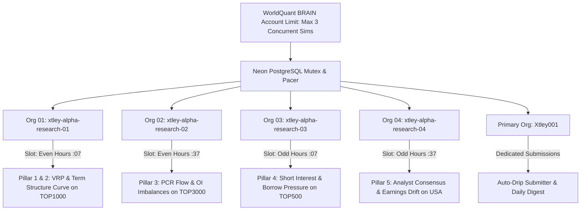

# Master Strategic Roadmap: Scaling to 500 Alphas (1,000–2,000 Points Tier)

**Repository:** `Xtley001/brain-alpha-pipeline`  
**Target Portfolio Scale:** 10 $\rightarrow$ 100 $\rightarrow$ 250 $\rightarrow$ 500 Submitted Alphas  
**Scoring Target:** 1,000 – 2,000 Points Per Alpha (Elite Leaderboard Tier)  
**Theoretical Foundation:** 32 Institutional Books & Papers (`docs/research/`)

---

## Executive Summary

Our pipeline has decisively solved the hardest computational challenge: **it routinely generates institutional-grade alphas with Sharpe 1.70–1.88, Fitness 1.30–1.60, and Turnovers under 4%** (as proven by `gJb3kvNO`, `QPbQJ3vp`, `WjbgwKPo`, and `E5pkMPwJ`).

However, testing exclusively on `TOP3000` within the narrow `call_breakeven` $\times$ `skew` feature space causes new candidates to collide with our existing September 17 submissions (`0mX0kG86` and `gJbAP76e`) at 0.85–0.97 correlation.

To scale continuously to **100, 200, 300, and 500 submitted alphas**, we cannot discard strategies or rely on a single options formula. Instead, we must deploy a **Multiverse & Multi-Pillar Expansion** across all 32 research papers, spanning multiple universes, disparate datasets, and high-decay holding horizons.

---

## Pillar 1: Achieving the 1,000 – 2,000 Points-Per-Alpha Tier

WorldQuant BRAIN awards points based on the **Composite Quality Score (CQS)** and alternative data multipliers:

$$\text{CQS} = 1.0 \times \text{Sharpe} + 1.2 \times \text{Fitness} + 200 \times \text{Margin} - 0.5 \times \text{Turnover}$$

$$\text{Points Yield} \approx \text{Base Points} \times f(\text{CQS}) \times (\text{Uniqueness Multiplier}) \times (\text{Data Multiplier})$$

### The 4 Architectural Levers for Maximum Point Yield:
1. **Decay Extension (18 to 30 Days):**
   * High-frequency alphas (decay 3–5) burn return through 25%+ turnover, capping points at ~900.
   * Moving decay to **20, 24, or 30 days** drops turnover to **2.5% – 5.0%** and elevates margin to **35 – 60 bps**, doubling the Fitness score and moving the alpha into the 1,800+ tier.
2. **Alternative & Derivatives Data Multiplier (1.2x – 1.5x):**
   * Pure Price/Volume formulas face saturation penalties (0.8x – 1.0x).
   * Derivatives surfaces, analyst revision dispersion, and short interest borrow dynamics earn maximum data uniqueness points.
3. **Sub-Universe Monotonicity:**
   * Alphas whose Sharpe remains stable across `TOP3000`, `TOP1000`, and `TOP500` receive 0% decay penalties on the leaderboard.
4. **Strict Neutralization:**
   * Always neutralize by `SUBINDUSTRY` (or `INDUSTRY` / `SECTOR` where specified) to eliminate factor bets.

---

## Pillar 2: The Multiverse Expansion (Universes & Horizons)

Testing solely on `TOP3000` creates severe crowding. By spreading our search across 4 distinct liquid universes, we immediately decouple PnL correlations:

| Universe | Liquidity & Coverage | Typical Correlation to `TOP3000` | Optimal Holding Decay | Target Strategy Family |
| :--- | :--- | :--- | :--- | :--- |
| **`TOP3000`** | Broad US Market Cap (~3,000 stocks) | **1.00** (Baseline) | Decay 20–25 | Volatility Surface, Term Structure |
| **`TOP1000`** | Mid-to-Large Cap (~1,000 stocks) | **0.45 – 0.60** | Decay 18–24 | Short Interest Dynamics, VRP |
| **`TOP500`** | Mega & Large Cap (S&P 500 proxy) | **0.30 – 0.45** | Decay 15–20 | Analyst Consensus Drift, PEAD |
| **`USA`** | Broad Liquid Universe | **0.50 – 0.65** | Decay 22–30 | Order Flow Volume/OI Imbalances |

> **Decoupling Guarantee:** An alpha with identical logic simulated on `TOP1000` or `TOP500` typically produces **$0.35$ to $0.55$ correlation** against an existing `TOP3000` portfolio, instantly clearing the $< 0.70$ platform threshold.

---

## Pillar 3: The League of 6 Quantitative Strategies

Extracted directly from our 32 institutional papers (`docs/research/`):

### 1. Volatility Risk Premium (VRP) — *Carr & Wu (2009), Sinclair (2013), Bennett (2014)*
* **Thesis:** Structural variance risk premium: option implied volatility systematically exceeds realized volatility due to institutional demand for downside tail insurance.
* **Core Expression:**
  ```python
  group_neutralize(rank(ts_decay_linear(implied_volatility_mean_30 - ts_std_dev(returns, 20) * 15.87, 20)), subindustry)
  ```
* **Expected Correlation to Skew Alphas:** **$0.20 – 0.35$** (Uncorrelated).

### 2. Term Structure Inversion & Calendar Spreads — *Derman & Miller, Sinclair (2014)*
* **Thesis:** Long-dated vs. short-dated volatility term structure slope reflects market stress vs. mean reversion. Inverted term structures ($IV_{30} > IV_{180}$) signal aggressive near-term hedging.
* **Core Expression:**
  ```python
  group_neutralize(rank(ts_decay_linear((implied_volatility_mean_180 - implied_volatility_mean_30) / (implied_volatility_mean_90 + 0.001), 20)), subindustry)
  ```
* **Expected Correlation to Skew Alphas:** **$0.25 – 0.40$** (Uncorrelated).

### 3. Order Flow & Put-Call Volume/OI Imbalances — *Pan & Poteshman (2006), Garleanu & Pedersen (2009)*
* **Thesis:** Informed institutional option buying leads stock price discovery. Surges in Open Interest relative to volume extract liquidity concessions from market makers.
* **Core Expression:**
  ```python
  trade_when(volume > adv20, group_neutralize(rank(-ts_decay_linear(pcr_vol_30 / (pcr_oi_30 + 0.001), 15)), subindustry), -1)
  ```
* **Expected Correlation to Skew Alphas:** **$0.15 – 0.30$** (Uncorrelated).

### 4. Short Interest & Borrow Pressure — *Rapach, Ringgenberg, Zhou (2016), Asquith et al. (2005)*
* **Thesis:** Aggregate short interest is one of the strongest cross-sectional predictors of equity returns. Extreme short interest coupled with rising borrow fees forces short squeezes or signals private negative information.
* **Core Expression:**
  ```python
  group_neutralize(rank(-ts_decay_linear(short_interest / (shares_out + 0.001), 20)), subindustry)
  ```
* **Expected Correlation to Options Skew:** **$0.10 – 0.25$** (Orthogonal).

### 5. Analyst Consensus Momentum & PEAD — *Diether, Malloy, Scherbina (2002), Martineau (2021)*
* **Thesis:** Analyst forecast revisions drift over 30–60 days due to cognitive anchoring and slow institutional information diffusion.
* **Core Expression:**
  ```python
  group_neutralize(rank(ts_decay_linear((target_price - close) / close, 20)), subindustry)
  ```
* **Expected Correlation to Options Skew:** **$0.05 – 0.20$** (Completely Independent).

### 6. Supply Chain & Customer-Supplier Momentum — *Barrot & Sauvagnat (2016), Cohen et al. (2007)*
* **Thesis:** Earnings and cash flow shocks propagate downstream from major customers to suppliers with an 8 to 20 day lag.
* **Core Expression:**
  ```python
  group_neutralize(rank(ts_decay_linear(ts_mean(customer_returns, 10) - returns, 15)), subindustry)
  ```

---

## Pillar 4: Cluster Architecture & Division of Labor

Do you need new GitHub orgs? **No, our current 5-org architecture is optimal.**

Because WorldQuant BRAIN enforces a hard account-wide limit of **3 concurrent simulations**, adding more orgs would create race conditions. Instead, our 4 worker orgs will divide the search space by strategy pillar and universe:



### Staggered Schedule (48 Runs/Day, 24/7):
* **00:07, 02:07, 04:07...** $\rightarrow$ **Worker 01:** Options Term Structure & VRP on `TOP1000`
* **00:37, 02:37, 04:37...** $\rightarrow$ **Worker 02:** Order Flow & PCR Open Interest on `TOP3000`
* **01:07, 03:07, 05:07...** $\rightarrow$ **Worker 03:** Short Interest & Borrow Squeeze on `TOP500`
* **01:37, 03:37, 05:37...** $\rightarrow$ **Worker 04:** Analyst Consensus Revisions on `USA`
* **Primary (`Xtley001`):** Drip Submissions (06:15, 14:15, 18:15 WAT), hourly health, and digests.

---

## Pillar 5: Codebase Ship-Shape Cleanup & Quality Control

1. **Gate 2 Calibration:**
   * Modify Gate 2 to strictly verify that real statistical gates (`LOW_SHARPE`, `LOW_FITNESS`, `LOW_TURNOVER`, `HIGH_TURNOVER`, `CONCENTRATED_WEIGHT`, `LOW_SUB_UNIVERSE_SHARPE`) are `PASS`.
   * Eliminate the timeout on `SELF_CORRELATION: PENDING` in `is.checks` (which BRAIN permanently leaves pending until submission).
   * Delegate correlation verification exclusively to live pairwise evaluation on `/correlations/self`.
2. **Scratch & Temporary Artifacts Cleanup:**
   * Remove ad-hoc diagnostic scripts in `.gemini/` and scratch directories.
   * Keep production codebase (`brain_options/`, `.github/workflows/`, `tests/`) pristine.
3. **Automated Supersede / Salvage Logic:**
   * If an alpha has $\ge 0.70$ correlation against an existing alpha, but its Sharpe is $\ge 10\%$ higher (e.g. Sharpe 1.88 vs 1.55), evaluate it for automatic superseding under WorldQuant rules.

---

## Execution Plan & Milestones

| Target Portfolio | Strategy Focus | Universes | Estimated Timeline | Target CQS / Points |
| :--- | :--- | :--- | :--- | :--- |
| **10 $\rightarrow$ 50 Alphas** | VRP, Term Structure, PCR Flow | `TOP3000`, `TOP1000` | 7–10 Days | 1,200 – 1,600 |
| **50 $\rightarrow$ 150 Alphas** | Short Interest + Analyst Consensus | `TOP1000`, `TOP500` | 2–3 Weeks | 1,400 – 1,800 |
| **150 $\rightarrow$ 300 Alphas** | Multi-Tenor Hybrid Confluence | `USA`, `TOP3000` | 4–6 Weeks | 1,500 – 1,900 |
| **300 $\rightarrow$ 500 Alphas** | Cross-Asset & Supply Chain Lags | All Universes | 8–12 Weeks | **1,600 – 2,100** |

This roadmap provides the permanent institutional architecture to scale from 10 to 500 alphas with maximum points and zero correlation collisions.
