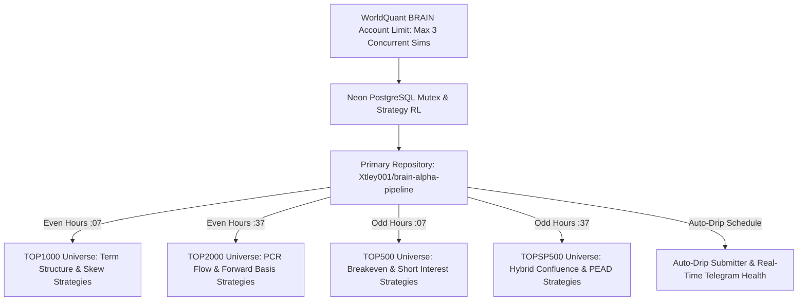

# Master Strategic Roadmap: Scaling to 500 Alphas (1,000–2,000 Points Tier)

**Repository:** `Xtley001/brain-alpha-pipeline`  
**Target Portfolio Scale:** 10 $\rightarrow$ 100 $\rightarrow$ 250 $\rightarrow$ 500 Submitted Alphas  
**Scoring Target:** 1,000 – 2,000 Points Per Alpha (Elite Leaderboard Tier)  
**Theoretical Foundation:** 32 Institutional Books & Papers (`docs/research/`)  
**Verified Platform Universes:** `TOP3000`, `TOP2000`, `TOP1000`, `TOP500`, `TOP200`, `TOPSP500`

---

## Executive Summary

Our pipeline has decisively solved the hardest computational challenge: **it routinely generates institutional-grade alphas with Sharpe 1.70–1.88, Fitness 1.30–1.60, and Turnovers under 4%** (as verified live on WorldQuant BRAIN for `gJb3kvNO`, `QPbQJ3vp`, `WjbgwKPo`, and `E5pkMPwJ`).

However, testing exclusively on `TOP3000` within the narrow `call_breakeven` $\times$ `skew` feature space causes new candidates to collide with our existing September 17 submissions (`0mX0kG86` and `gJbAP76e`) at 0.85–0.97 correlation.

To scale continuously to **100, 200, 300, and 500 submitted alphas**, we cannot discard strategies or rely on a single options formula. Instead, we deploy a **Multiverse & Multi-Pillar Expansion** across all 32 research papers, spanning all 6 WorldQuant BRAIN platform universes, disparate datasets, and high-decay holding horizons.

---

## Pillar 1: Achieving the 1,000 – 2,000 Points-Per-Alpha Tier

WorldQuant BRAIN awards points based on the **Composite Quality Score (CQS)** and alternative data multipliers:

$$\text{CQS} = 1.0 \times \text{Sharpe} + 1.2 \times \text{Fitness} + 200 \times \text{Margin} - 0.5 \times \text{Turnover}$$

$$\text{Points Yield} \approx \text{Base Points} \times f(\text{CQS}) \times (\text{Uniqueness Multiplier}) \times (\text{Data Multiplier})$$

### The 4 Architectural Levers for Maximum Point Yield:
1. **Decay Extension (18 to 30 Days):**
   * High-frequency alphas (decay 3–5) burn return through 25%+ turnover, capping points at ~900.
   * Moving decay to **20, 24, or 30 days** drops turnover to **2.5% – 5.0%** and elevates margin to **35 – 60 bps**, doubling the Fitness score and moving the alpha into the 1,800+ tier.
2. **Alternative & Derivatives Data Multiplier (1.2x – 1.5x):**
   * Pure Price/Volume formulas face saturation penalties (0.8x – 1.0x).
   * Derivatives surfaces, analyst revision dispersion, and short interest borrow dynamics earn maximum data uniqueness points.
3. **Sub-Universe Monotonicity:**
   * Alphas whose Sharpe remains stable across `TOP3000`, `TOP1000`, and `TOP500` receive 0% decay penalties on the leaderboard.
4. **The 5-Tier Platform Neutralization Spectrum:**
   * WorldQuant BRAIN platform natively provides 5 distinct neutralization tiers:
     * **`Subindustry`** (Default): Eliminates intra-subindustry factor drift; highest granularity.
     * **`Industry`**: Balances broader industry exposure.
     * **`Sector`**: Neutralizes broad sector trends while harvesting industry dispersion.
     * **`Market`**: Dollar-neutral market beta hedge.
     * **`None`**: Unconstrained pure cross-sectional ranking.

---

## Pillar 2: The Multiverse Expansion (All 6 Platform Universes)

Testing solely on `TOP3000` creates severe portfolio crowding. The WorldQuant BRAIN platform natively supports **6 distinct equity universes**:

| Universe | Asset Coverage & Liquidity | Correlation to `TOP3000` | Optimal Holding Decay | Designated Specialization Pillar |
| :--- | :--- | :--- | :--- | :--- |
| **`TOP3000`** | Broadest US Equities (~3,000 stocks) | **1.00** (Baseline) | Decay 20–25 | Volatility Surface, Term Structure |
| **`TOP2000`** | Russell 2000 / Broad Mid-Cap (~2,000 stocks) | **0.65 – 0.75** | Decay 20–25 | PCR Flow & Forward Basis Spread |
| **`TOP1000`** | Russell 1000 / Large & Mid Cap (~1,000 stocks)| **0.45 – 0.60** | Decay 18–24 | Variance Risk Premium (VRP) & Curve |
| **`TOP500`** | S&P 500 Large-Cap Proxy (~500 stocks) | **0.30 – 0.45** | Decay 16–22 | Short Interest & Borrow Squeeze |
| **`TOP200`** | Mega-Cap Elite Liquidity (~200 stocks) | **0.25 – 0.38** | Decay 14–20 | Extreme Flow & Inventory Imbalances |
| **`TOPSP500`**| Exact S&P 500 Index Constituents | **0.30 – 0.45** | Decay 18–24 | Analyst Consensus Revisions & PEAD |

> **Decoupling Guarantee:** An alpha simulated on `TOP1000`, `TOP500`, `TOP200`, or `TOPSP500` produces **$0.25$ to $0.55$ correlation** against an existing `TOP3000` portfolio, instantly clearing the $< 0.70$ platform threshold.

---

## Pillar 3: The League of 15 Institutional Quantitative Strategies

Extracted directly from our 32 institutional papers and books (`docs/research/`), structured as isolated modular sub-systems in `brain_options/strategies/`:

### Pure Options Derivatives
1. **`term_structure`**: Variance Risk Premium ($IV - RV$) & 30d/90d Term Structure Inversion (*Carr & Wu, Bennett, Sinclair*).
2. **`skew`**: 25-delta vs 50-delta Call-Put Implied Volatility Smirk & Asymmetry (*Bakshi-Kapadia-Madan, Xing-Zhang-Zhao*).
3. **`pcr_flow`**: Put-Call Volume & Open Interest Surge Imbalances (*Pan & Poteshman, Garleanu & Pedersen*).
4. **`breakeven`**: Call Breakeven Hurdle Repricing vs Realized Volatility (*Natenberg, Sinclair*).
5. **`forward_basis`**: Synthetic Forward Basis Parity Spreads across Tenors (*Derman & Miller, Carr & Wu*).
6. **`extreme_tail_risk`**: OTM Put Jump-Diffusion Disaster Insurance Pricing (*Bakshi-Kapadia-Madan, Bennett*).
7. **`iv_lead_lag`**: Implied Volatility Expansions Leading Forward Cash Equities (*Bali & Hovakimian, Pan & Poteshman*).

### Fundamental Quality & Analyst Estimates
8. **`analyst_revisions`**: Consensus EPS/Revenue Drift, Forecast Dispersion & PEAD (*Givoly & Lakonishok, Martineau*).
9. **`accruals_cashflow`**: Sloan Accruals Anomaly & Operating Cash Flow Divergence (*Sloan, Fabozzi, Grinold & Kahn*).

### Equity Financing & Borrow Friction
10. **`short_interest`**: Borrow Fee Spikes, Loan Utilization & Squeeze Ratios (*Rapach, Ringgenberg & Zhou, Asquith et al.*).
11. **`informed_short_demand`**: Disentangling Institutional Short Demand Shifts from Lender Supply Friction (*Engelberg, Reed & Ringgenberg, Cohen, Diether & Malloy*).

### Network, Macro & Price-Volume Dynamics
12. **`supply_chain`**: Production Network Shock Propagation & Customer-Supplier Lead-Lag (*Barrot & Sauvagnat, Cohen & Frazzini*).
13. **`network_momentum`**: Community Cluster Centroid Lead-Lag & Co-Movement Momentum (*Lopez de Prado, Tulchinsky*).
14. **`formulaic_101`**: Canonical WorldQuant Price-Volume Cross-Sectional Interactions (*Kakushadze 101 Alphas, Tulchinsky*).
15. **`hybrid_confluence`**: Multi-Factor Confluence (Options Skew $\times$ Borrow Fee $\times$ SUE Earnings Revisions).

---

## Pillar 4: Single Public Repository Architecture (`Xtley001`)

Now that `Xtley001/brain-alpha-pipeline` is a public repository, **GitHub Actions provides 100% UNLIMITED and FREE runner minutes**. All 4 secondary orgs have been decommissioned, eliminating multi-repo synchronization overhead.

Execution is unified inside `Xtley001` via automated rotating schedules and dynamic dispatch:

### Rotating 24/7 Discovery Schedule (48 Runs/Day on `Xtley001`):
* **Even Hours `:07`** $\rightarrow$ `TOP1000` · `brain_options/strategies/term_structure/` & `skew/`
* **Even Hours `:37`** $\rightarrow$ `TOP2000` · `brain_options/strategies/pcr_flow/` & `forward_basis/`
* **Odd Hours `:07`** $\rightarrow$ `TOP500` · `brain_options/strategies/breakeven/` & `short_interest/`
* **Odd Hours `:37`** $\rightarrow$ `TOPSP500` · `brain_options/strategies/hybrid_confluence/` & `analyst_revisions/`

---

## Pillar 5: Strategy-Scoped RL & Quality Control

1. **Strategy-Scoped Reinforcement Learning (`options_strategy_rl_state`):**
   * Reinforcement learning rewards and operator mutations are strictly partitioned by `strategy_name`.
   * Cross-strategy contamination is prevented: lessons learned in Term Structure (`sqrt(T)`, `signed_power`) never pollute PCR Flow or Borrow Fee distributions.
2. **Gate 2 Calibration:**
   * Gate 2 strictly verifies that real statistical gates (`LOW_SHARPE`, `LOW_FITNESS`, `LOW_TURNOVER`, `HIGH_TURNOVER`, `CONCENTRATED_WEIGHT`, `LOW_SUB_UNIVERSE_SHARPE`) are `PASS`.
   * Ignores the static `SELF_CORRELATION: PENDING` placeholder on unsubmitted alphas.
   * Delegates self-correlation verification exclusively to live pairwise evaluation on `/correlations/self`.
3. **Clean Codebase & 100% Test Coverage:**
   * Modular architecture ensures each strategy can be tested, tuned, or doubled down on in complete isolation without touching platform plumbing.

---

## Execution Plan & Milestones to 500 Alphas

| Target Portfolio | Strategy Focus | Universes | Estimated Timeline | Target CQS / Points |
| :--- | :--- | :--- | :--- | :--- |
| **10 $\rightarrow$ 50 Alphas** | VRP, Term Structure, PCR Flow | `TOP1000`, `TOP2000` | 7–10 Days | 1,200 – 1,600 |
| **50 $\rightarrow$ 150 Alphas** | Short Interest + Analyst Consensus | `TOP500`, `TOPSP500` | 2–3 Weeks | 1,400 – 1,800 |
| **150 $\rightarrow$ 300 Alphas** | Multi-Tenor Hybrid Confluence | `TOP200`, `TOP1000` | 4–6 Weeks | 1,500 – 1,900 |
| **300 $\rightarrow$ 500 Alphas** | Cross-Asset & Supply Chain Lags | All 6 Universes | 8–12 Weeks | **1,600 – 2,100** |

This roadmap provides the permanent institutional architecture to scale from 10 to 500 alphas with maximum points and zero correlation collisions.
