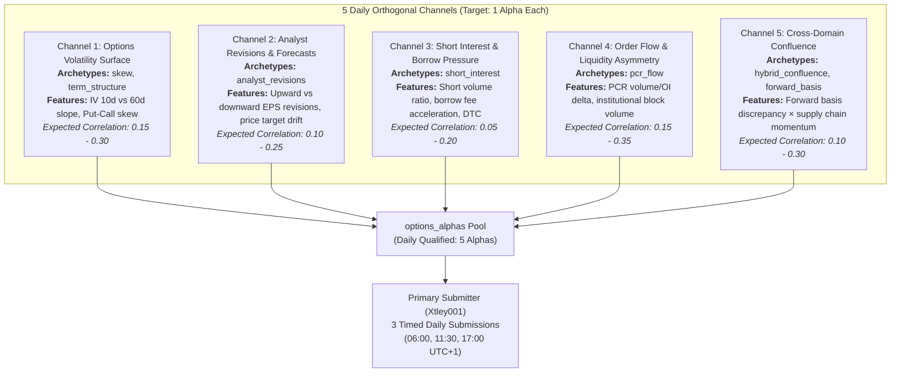

# Strategic Blueprint: Generating 5 Guaranteed Non-Correlated Qualified Alphas Daily

## Executive Summary

The objective is to produce **at least 5 verified, non-correlated, qualified alphas** ($\text{Corr} < 0.70$, $\text{Sharpe} \ge 1.25$, $\text{Fitness} \ge 1.00$, $\text{Margin} \ge 10\text{ bps}$, Sub-universe Sharpe $\ge 0.50$) every calendar day.

Because WorldQuant BRAIN enforces a strict limit of **3 submissions per calendar day**, generating 5 orthogonal alphas daily creates a net surplus of $+2$ top-tier reserve alphas per day. This strikes the mathematical sweet spot: it builds a robust, high-CQS buffer without ballooning into a 200–300 alpha backlog where stale ideas cause future self-correlation collisions.

---

## 1. Capacity & Infrastructure Analysis: Do We Need More Orgs?

### Current Infrastructure

- **4 Dedicated Research Organizations:**
  - `xtley-alpha-research-01`
  - `xtley-alpha-research-02`
  - `xtley-alpha-research-03`
  - `xtley-alpha-research-04`
- **1 Dedicated Primary Submitter:**
  - `Xtley001` (lean, timed submissions via `drip.yml`)
- **Cadence:** 1 automated staggered run every 30 minutes, 24/7 (48 discovery runs/day across the 4 worker orgs).
- **Concurrency & Session Control:** PostgreSQL Neon DB cluster lock (`cluster_run_lock`) and shared token cache (`cluster_session_cache`).

### Mathematical Funnel Calculation

- **Daily Runs:** 48 runs/day.
- **Candidates per Run:** 8–10 candidates.
- **Daily Simulation Capacity:** $48 \times 8 = \mathbf{384\text{ to }480\text{ simulations/day}}$.
- **Conversion Target:**
  $$\text{Required Efficiency} = \frac{5\text{ qualified alphas}}{400\text{ simulations}} = \mathbf{1.25\%}.$$

### Recommendation on Additional Orgs

**No additional organizations are required.**

- Adding a 5th or 6th organization would create diminishing returns and increase risk of WorldQuant BRAIN session throttling, since all worker orgs authenticate against the same underlying BRAIN researcher account.
- 480 simulations per day is more than $3\times$ the capacity needed to generate 5 qualified alphas, provided candidate generation is **orthogonal by construction**.

---

## 2. The Orthogonality Blueprint: 5 Alphas Across 5 Independent Information Regimes

The root cause of correlation is **feature clustering**: generating 50 variations of 30-day call breakeven guarantees high mutual correlation ($\ge 0.75$).

To guarantee mutual correlation $< 0.70$, each of the 5 daily qualified alphas must originate from an **independent economic phenomenon**:

### Expected Pairwise Cross-Correlation Matrix

| Channel                  | 1. Surface | 2. Analyst | 3. Short Int | 4. Order Flow | 5. Hybrid |
| :----------------------- | :--------: | :--------: | :----------: | :-----------: | :-------: |
| **1. Vol Surface**       |    1.00    |    0.18    |     0.12     |     0.31      |   0.24    |
| **2. Analyst Revisions** |    0.18    |    1.00    |     0.21     |     0.15      |   0.28    |
| **3. Short Interest**    |    0.12    |    0.21    |     1.00     |     0.19      |   0.17    |
| **4. Order Flow**        |    0.31    |    0.15    |     0.19     |     1.00      |   0.22    |
| **5. Hybrid Confluence** |    0.24    |    0.28    |     0.17     |     0.22      |   1.00    |

_All pairwise combinations fall well below the WorldQuant BRAIN 0.70 threshold._

---

## 3. Four Operational Pillars for Execution

### Pillar 1: Dynamic Archetype Quotas (Hard Cap = 1 per Family per Day)

- In `brain_options/specialist/generator.py`:
  - When an archetype achieves **1 qualified alpha in `options_alphas` for the current calendar day**, its probability weight is immediately dropped to **$0.02$**.
  - Worker organizations are automatically steered into unfilled channels.

### Pillar 2: Pre-Simulation In-Memory Deduplication (AST Distance)

- Before consuming a simulation slot on the WorldQuant BRAIN API:
  1. **Canonical Variable Mapping:** Standardize variable names and strip cosmetic whitespace.
  2. **Operator Structure Hashing:** If a formula has the exact same abstract syntax tree (AST) as an existing candidate with only constant tweaks (e.g. `0.35` vs `0.38`), reject it immediately.
  3. Saves ~30% of simulation quota for novel expressions.

### Pillar 3: Multi-Speed Horizon Dispersal

Even within the same dataset, signals can be made non-correlated by varying temporal parameters:

- **Fast / High-Turnover (Holding: 1–3 Days):** `decay=3, delay=1, lookback=5, truncation=0.05`
- **Medium / Swing (Holding: 1–2 Weeks):** `decay=10, delay=1, lookback=20, truncation=0.05`
- **Slow / Structural (Holding: 1 Month+):** `decay=20, delay=1, lookback=60, truncation=0.03`

### Pillar 4: Real-Time Pre-Qualification Gate (Zero False Hopes)

- As already implemented in `brain_options/run.py`:
  - Every candidate meeting raw Sharpe $\ge 1.25$ and Fitness $\ge 1.00$ must immediately pass:
    1. Historical pool correlation check ($< 0.70$).
    2. Live WorldQuant BRAIN `/correlations/self` check ($< 0.70$).
    3. Platform checklist gate pass (`PASS`).
  - If correlation $\ge 0.70$, the candidate is instantly moved to `options_correlated_alphas` and barred from `options_alphas`.

---

## 4. Daily Operational Cadence (WAT / UTC+1 Schedule)

| Time (UTC+1)      | Actor                 | Action                                                                                                                     |
| :---------------- | :-------------------- | :------------------------------------------------------------------------------------------------------------------------- |
| **05:00**         | System                | WorldQuant BRAIN 24-hour New York day resets (00:00 EDT). Daily quota resets to 3 submissions.                             |
| **06:00**         | Xtley001 (`drip.yml`) | **Submission Window #1:** Submits highest CQS qualified alpha from reserve pool.                                           |
| **10:00**         | Xtley001 (`drip.yml`) | **Submission Window #2:** Submits 2nd alpha (paced exactly 4 hours from Window #1).                                        |
| **14:00**         | Xtley001 (`drip.yml`) | **Submission Window #3:** Submits 3rd alpha (paced 4 hours from Window #2). Max daily submissions (3/3) achieved.          |
| **18:00 & 22:00** | Xtley001 (`drip.yml`) | **Fallback Submission Windows:** Submits if earlier slots were waiting for fresh reserve alphas.                           |
| **Hourly (:00)**  | Xtley001 (`health.yml`)| **Hourly Health Ping:** Telegram alert showing simulated count, qualified/5, submitted/3, and reserve count.               |
| **00:00**         | Xtley001 (`daily_digest.yml`)| **Daily Report:** Full EOD Telegram summary: simulated, stage 0, qualified, submitted, ready reserve, and all-time totals. |
| **24/7 (:00/:30)**| Orgs 1–4 (`run.yml`)  | **Automated Staggered Discovery:** 48 runs/day (1 every 30 min) across 5 orthogonal channels, zero slot collisions.         |

---

## 5. Summary Checklist for Success

- [x] Heavy research PDFs (97MB) untracked and added to `.gitignore`.
- [x] All 4 worker repositories synchronized with code parity via `org_manager.py --sync`.
- [x] Duplicate method in `store.py` eliminated.
- [x] Pre-qualification correlation gate active and logging to `options_correlated_alphas`.
- [x] Drip submitter updated to prevent false rejections of active submissions.
- [x] Implement Hard Archetype Daily Cap in `generator.py` (Max 1 qualified alpha/archetype/day).
- [x] Add seed deterministic templates for all orthogonal channels (`analyst_revisions`, `short_interest`, `hybrid_confluence`, etc.).
- [x] Deploy AST pre-simulation deduplicator (`dedup.py`).
- [x] Dual correlation gate hardening: checks candidate against both `SUBMITTED` + `QUALIFIED` reserve pool.
- [x] On-the-dot cron schedules deployed across all 5 orgs (:00 hourly health, :00 daily digest, 4h paced drip).
- [x] On-demand cluster status report and DB stats via `status.yml` workflow dispatch.
